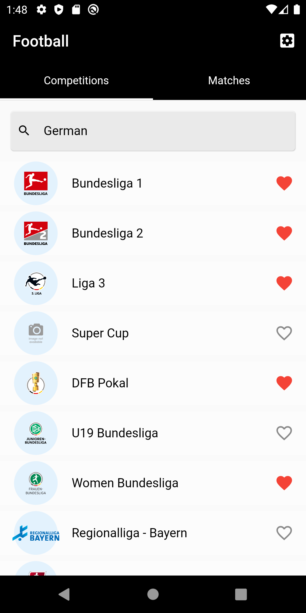
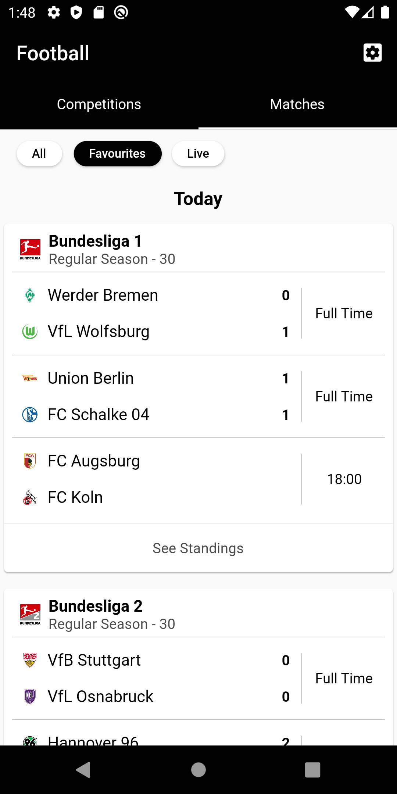
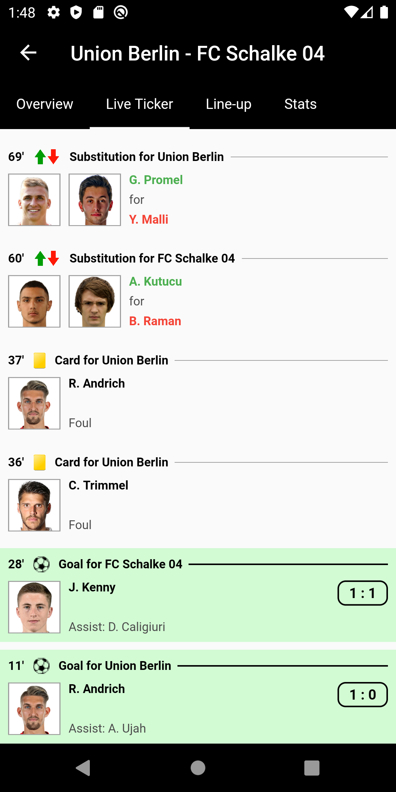
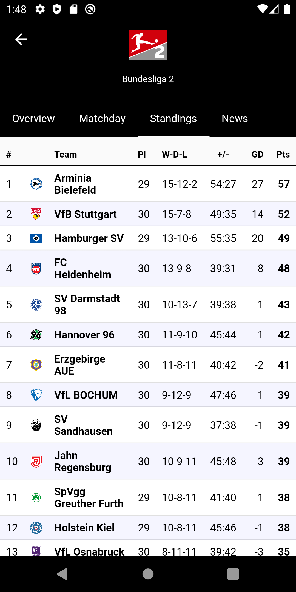
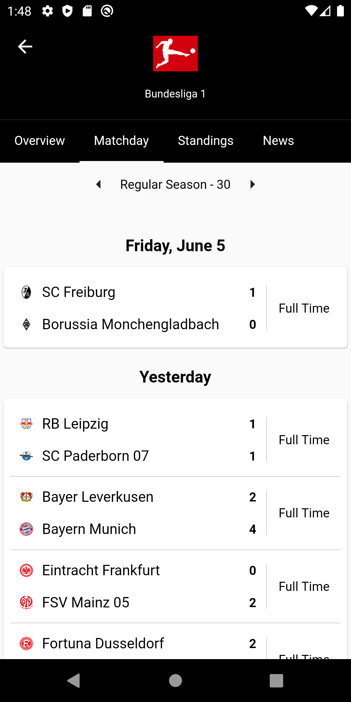
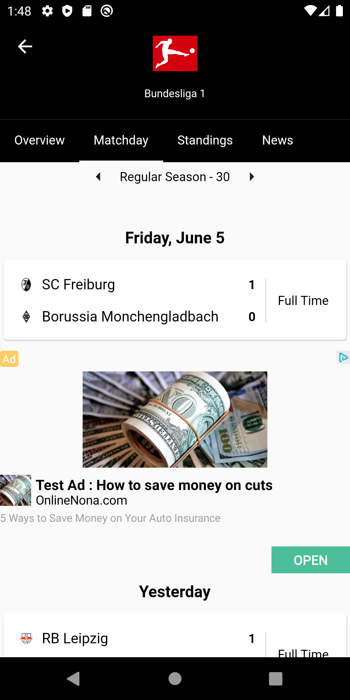

# FlutterFootball

My first mobile project using Flutter. A small demo project for football matches, including the use of external APIs and integrating with Google Admob.

## Features

This project is a starting point for a Flutter application.

## Getting Started

Add your own google-services.json file with your own admob settings.

Set up [Firebase](https://firebase.google.com/) for remote configuration.

### Data Providers
I'm currently using the Beta version of [https://www.api-football.com/](https://www.api-football.com/) which is still under development.

Initially, I used [https://www.football-data.org/](https://www.football-data.org/) as data provider. There are still some working features available.
Get a key from [https://www.football-data.org/](https://www.football-data.org/) and add it to Remote Config of Firebase (key: football_data_api_token).

